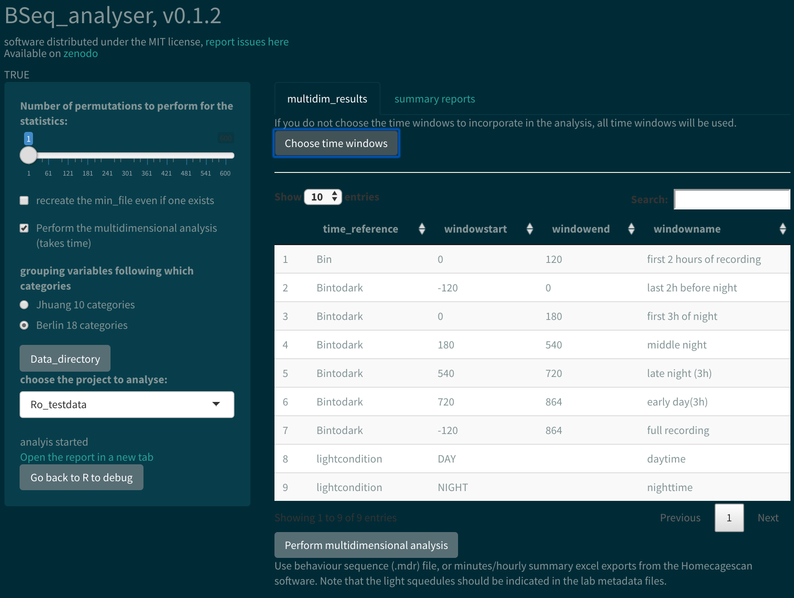

# Summary

Automated mice phenotyping via high throughput behaviour analysis of home cage behaviour has brought hope for a more effective and efficient way to test rodent models of diseases. While different software track behavioural motives through time, software to analyse and archive this rich data has been lacking.
Here we present an open source free software, actionable via a web browser, performing state of the art multidimensional analysis of home cage monitoring data, and creating an open repository of the linked metadata (while the data may be published separately). Some wild type data used to test the software is provided.

## Data input

We have been using raw time series of behavior categories produced by the (prioprietary) homecagescan software, when run on videos of mice set individually in a common lab cage for 22h. Summary data (in excel format) can also be loaded in the software, and it could easily be extended to work with other type of behaviour sequence data.

As a prerequisite to perform the analysis, the users are asked to publish some basic metadata about the dataset (who did what experiment). The data structure does not have to be changed, but an experiment metadata spreadsheet should be included, where animal information and data path are linked. To ease this process, we are providing a Shiny application that test the completeness of the metadata and push the master metadata information to osf. The analysis software read that osf file and can then load the data and experiment metadata (which can be kept locally and closed).

## Data analysis

We merged categories (Fig.1) and split the time series (to account for circadian rhythms linked effects) in different time windows. We ended up with 10 to 124 variable per session. In order to tell difference in the behaviour of different group of animals, we used a non-parametric test on the first component of a PCA ( a p-value and effect size is calculated). In addition, a machine learning algorithm can be used. Here we are using a support vector machine trained on one part of the data to predict the group appartenance of the other part of the data. The accuracy of this prediction is then compared to the distribution of accuracies obtained whie shuffling the groups randomly. 

While the shiny app performs that primary analysis, we provide a R code to run it by hand, or step by step. On top of facilitating code debugging, this allows the users to perform the usual analysis before running additional analysis steps (paired analysis for example) or changing the apparence of the figures. 

## Conclusion

This software  demonstrates the power of combining data management with its analysis to achieve a more efficient and effective analysis of the data, avoiding most pitfalls of multivariate analysis (p-hacking and harking) as well as human errors in the data processing. By providing this software and a easy way to add re-usable (FAIR) open datasets, we hope the community will expand the software capacities and increase the amount of the available open data.

# Figures

![Data and metadata structure. The master project\_metadata file was linking the address of the metadata files and the data folder. The experiment metadata file was linking to each data file (for clarity, only one folder was shown here). The format of the data was either .xlsx summary files (min or hour) or the HCS output files .mbr (behavior sequence) and .tbd (position), note that the software was not reading the .tbd files. By reading the master file, the computer could determine the path to every data file. Upon analysis, the software created a new folder indicating the software name and version. Its reports were saved there, while derived data files were saved in a folder named after the software name, but not its version.](paperfigure/tree-1.png)

# Acknowledgements

The authors want to thank member of the lab and the AOCF team: Andrei Istudor for his suggestion to integrate all used variables in the software report, Patrick Beye for discussion on the design of the analysis, Melissa Long for performing the home cage monitoring experiment and help with the creation of the metadata, Vladislav Nachev for scientific inputs and discussion. In addition, we want to thank Prof. Steele and Prof. King for fruitful discussion and access to code and data, and Cleversys Inc. for their help with the decoding of the HCS outputs.

# Dependencies

The software was build on R ressources [@R-base]. This work would not have been possible without the  tidyverse environment [@tidyverse,@stingr],  packages for interactive processing [@ShinyFiles,@Shiny,@plotly], statistical analysis [@svm,@rf,@Hmisc,@ica, @glmpath, @R-rstatix, @R-coin] and graphical interface [@RGraphics,@gridExtra,@plotly]. It also depended on the osfr package, which was still in development [@R-osfr] and loaded via the devtools package [@devtools]. We used the packrat package [@Rpackrat]  to dock the project.

# References